# Zigbee relay in the “wall socket box” - modkam.ru
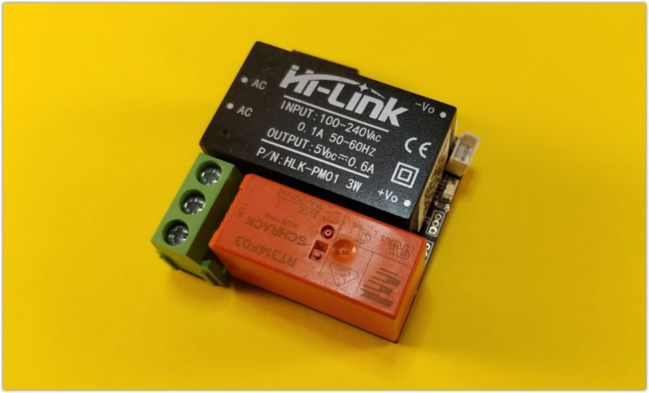

Continuing to develop its Zigbee network, it was faced with the fact that there are no normal controlled outlets. These are either options in the form of “adapters” with a maximum current of 10A, or a version from Xiaomi, but for a square socket. As a result, I had to do it myself.

##### THIS DEVICE CONTAINS HIGH VOLTAGE! IF IMPROPER OPERATION, THERE IS A RISK OF FIRE! YOU MUST BE AWARE OF THE CONSEQUENCES OF THE MANUFACTURE AND USE OF THIS DEVICE AND ASSUME ALL RISKS AND FEARS.

### Drew a diagram

It is based on a zigbee module from EBYTE [E18-MS1PA1-PCB](http://s.click.aliexpress.com/e/tObqN9He) with a 100 mW amplifier, since in addition to the function of the socket itself, this will also be the supporting part of the network in the form of routers. Consumption measurement is implemented on [ACS712](https://www.sparkfun.com/datasheets/BreakoutBoards/0712.pdf) at 20A, not the most accurate chip, but based on the results of selecting formulas and tests, it cannot be called a simple “display meter”. To switch the load, a [bistable](http://www.atof.ru/pea/relay/rl_097.shtml) relay [RT314F03](http://s.click.aliexpress.com/e/pQBy29yy) at 16A is used, It is also possible to install a monostable or lower current [HFD2/005-S-L2-D](http://s.click.aliexpress.com/e/poWY8whS) at 1A. The circuit is powered by a compact power supply unit [Hi-Link](http://s.click.aliexpress.com/e/N27RyW2U) at 5 or 3.3 volts, depending on the selected relay.

The circuit contains a button, with its help you can control the relay regardless of the presence of a network. To monitor the temperature in the socket for security purposes, two channels are used, the chip temperature and an external DS18B20 temperature sensor. An increase in temperature above a certain threshold may indicate problems with both the power contacts and the device itself.

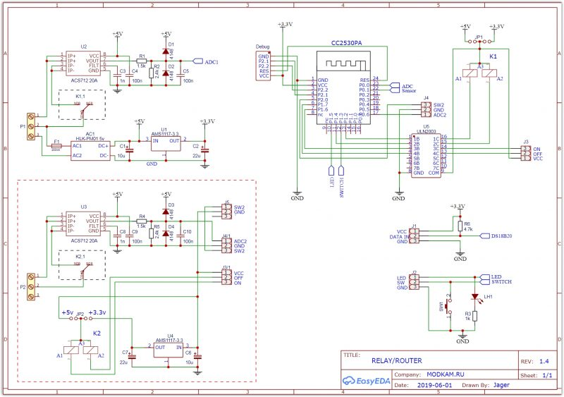

In addition to the relay function, the same board can be used as a switch in circuits where there is a “zero” in the socket boxes.

I made the payment in DipTrace

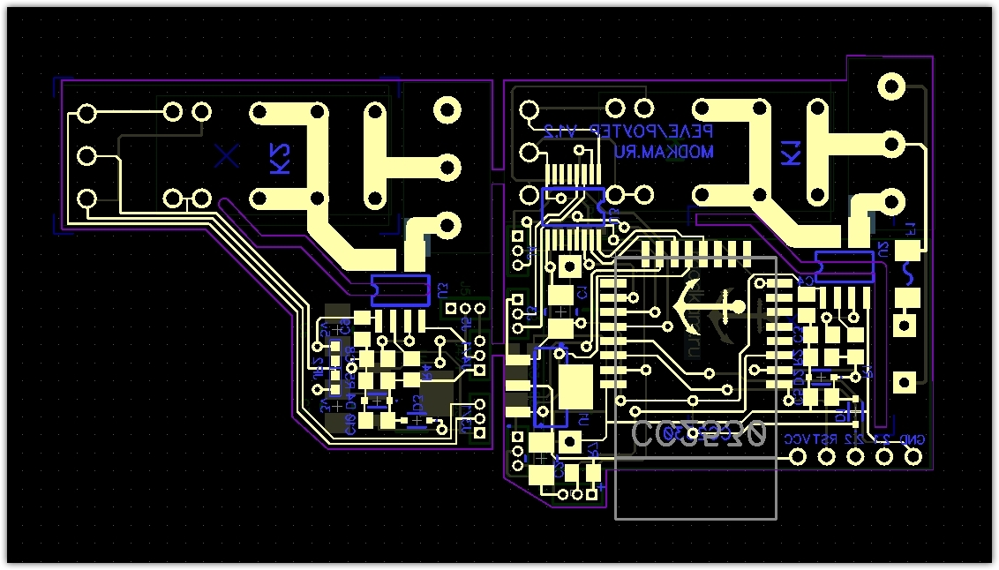
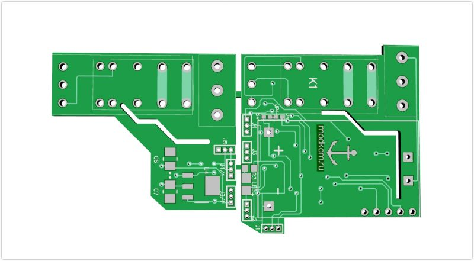
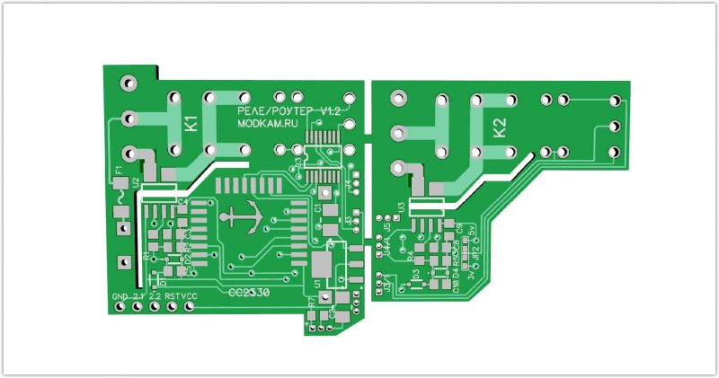

From the pictures you can see that there is a truncated subboard. There is a second channel on it, for a situation when two sockets are located nearby

Let's look at what should happen

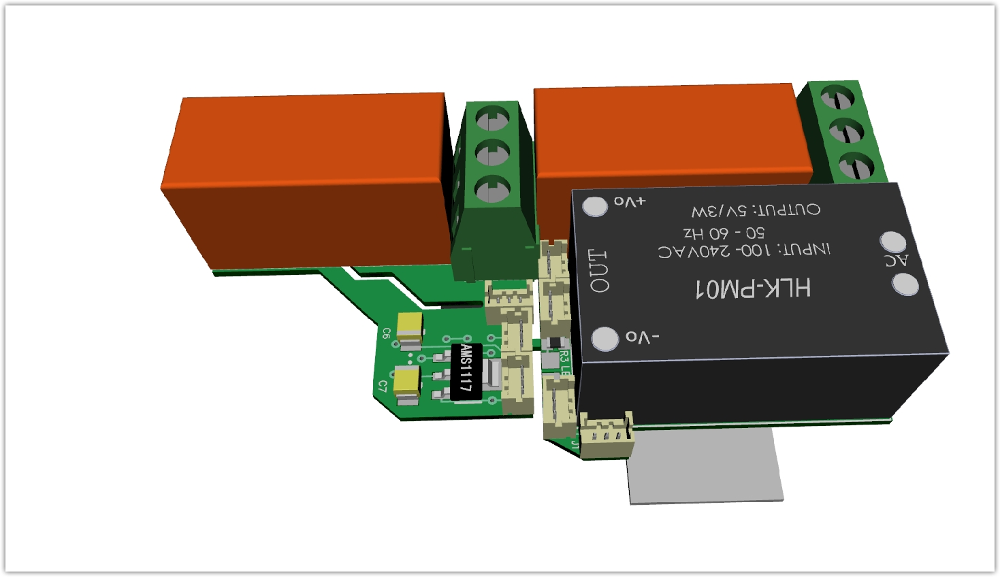
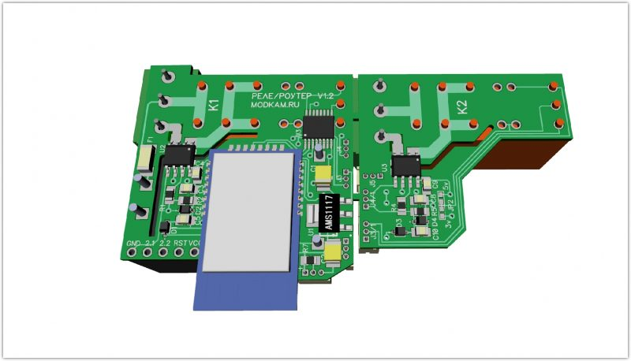

I ordered the boards at [jlcpcb](https://jlcpcb.com/)

There is not much soldering, the programming connector is temporary

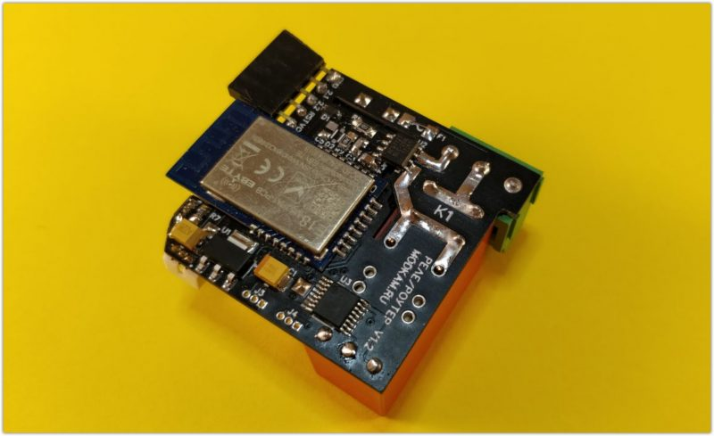

it fits to the wall box

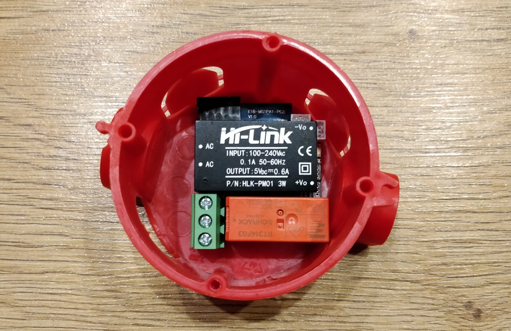

socket box with the smallest depth that I found.

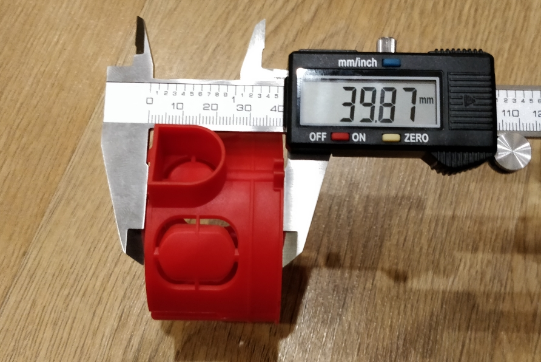

There is a gap of about 3-4mm between the socket and the device.

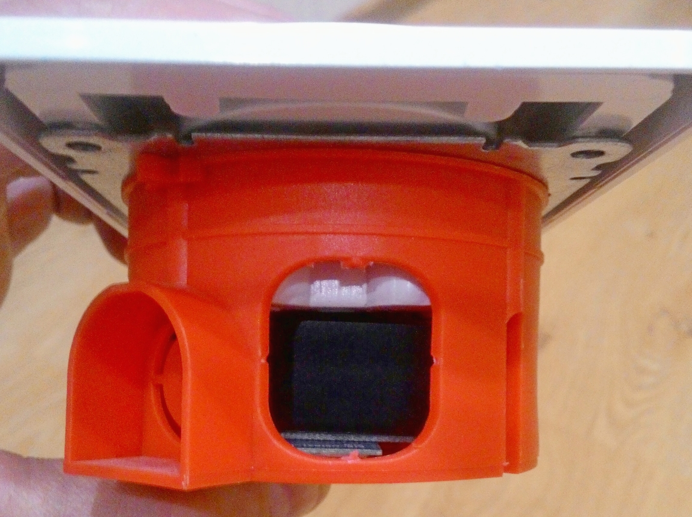

For the experiments I used a simple socket. The problem turned out to be finding a compact button, so for now this is an option.

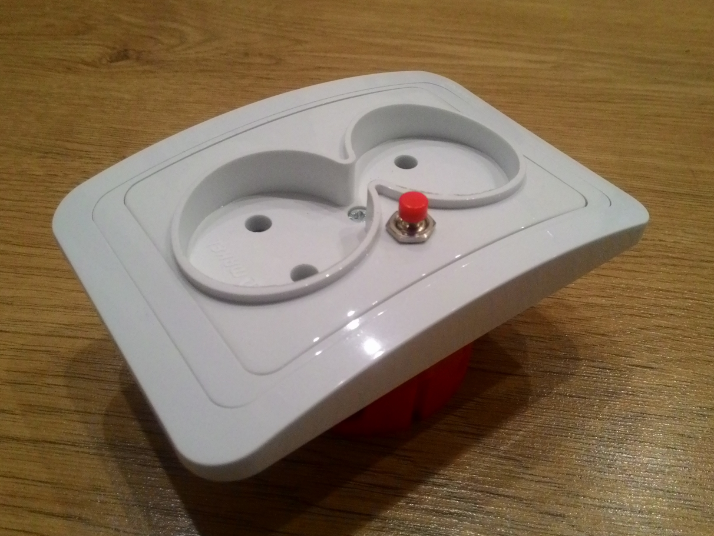

Due to its small size, the device can be built not only into a socket box, but also, for example, into a network extension cord.

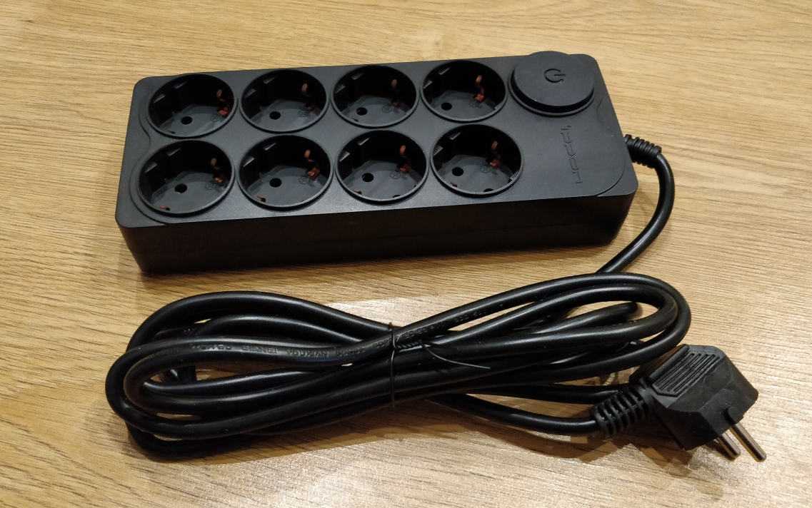
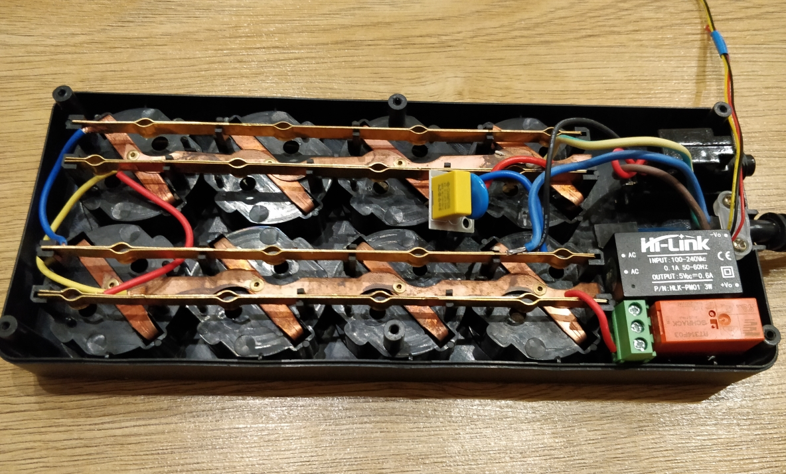

The main work on creating the firmware was done by [Anton Starikov](https://github.com/antst/), who brought it to release
[DJONvl](https://myzigbee.rubooks%D0%BF%D1%80%D0%BE%D1%88%D0%B8%D0%B2%D0%BA%D0%B8/page/vlk-diy-multi-flasher) , let's thank them.

The current firmware version supports only one channel for control and consumption measurement.

The device has support in ioBroker (will appear in the next update) thanks to the efforts of [Ilya Kirov](https://github.com/kirovilya/). Support has been implemented in [zigbee2mqtt](https://www.zigbee2mqtt.io/devices/DIYRuZ_rspm.html).

The device is given the name DIYRuZ\_rspm (relay switch power meter)

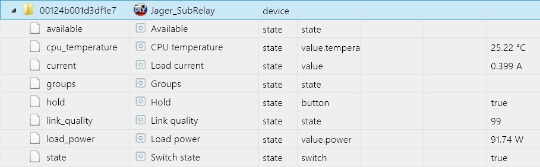

The screenshot shows the current consumption (heated incandescent lamp 95W) in amperes and the calculated consumption in watts. The relay remembers its state when power is lost.

For those who want to repeat [gerber board files](https://www.dropbox.com/s/wwozbhj0yld5tye/Relay.rar?dl=0), [PTVO](https://www.dropbox.com/s/3iv97faibe9v68o/BOM_relay2.xlsx?dl=0) , [firmware](https://www.dropbox.com/s/2371iic5ed959lk/SubRelay%20%2887%29.hex?dl=0).

P.S. The article turned out to be short, but in fact the project has been dragging on since June :)

The hardware contains two versions, the first version with different relays on a separate board

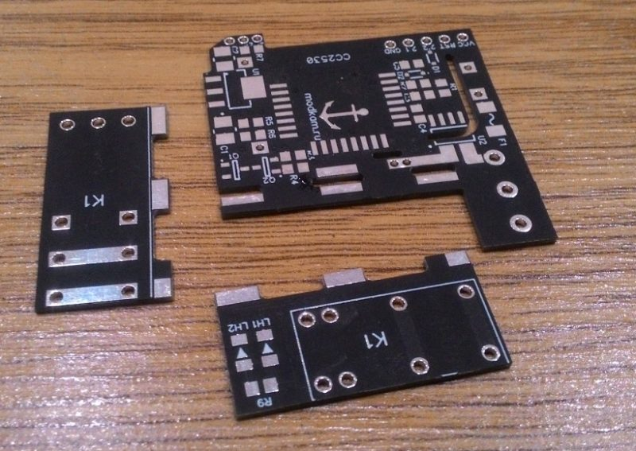
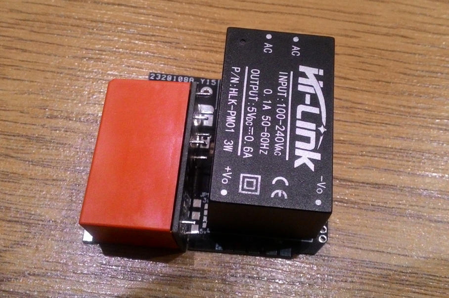
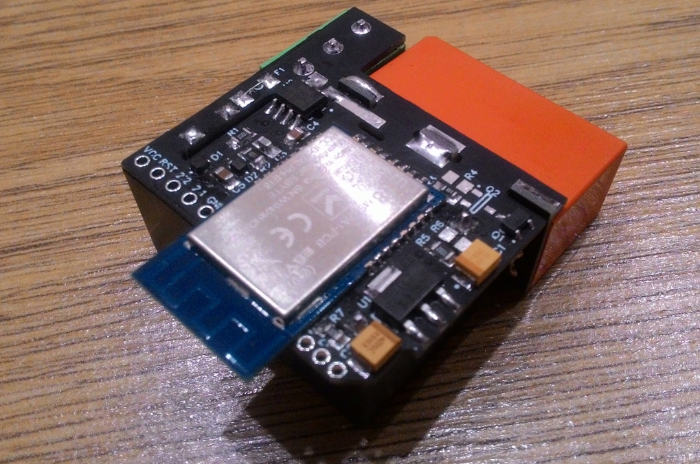

the firmware has gone through more than a hundred iterations during the debugging process measuring consumption.