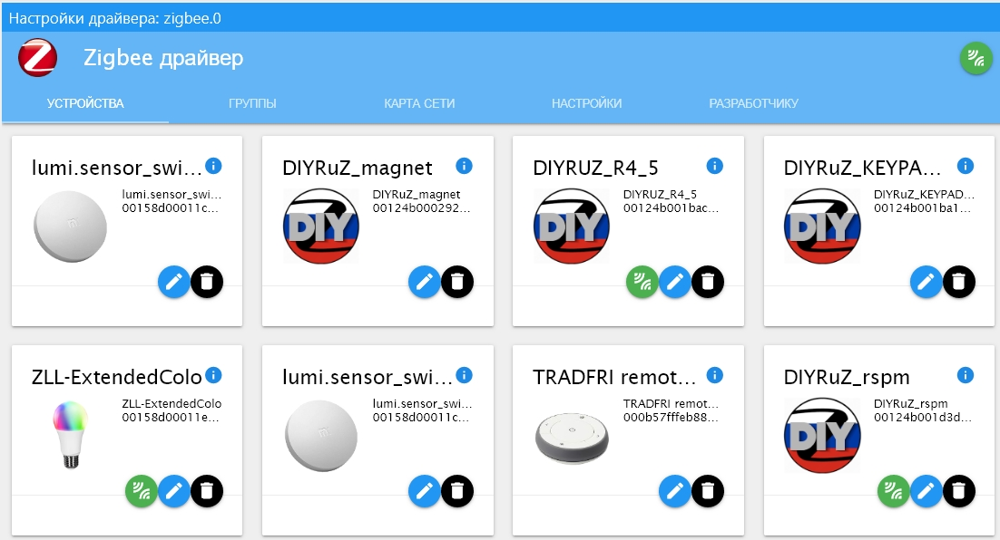

-----------------------------------------------------------------------------
github     : https://github.com/steve22184/casual-markdown-blog
title      : My Markdown Blog
subtitle   : Simple is the best
nav-group  : featured, new-3, tags, months
nav-width  : 320px
theme      : dark
menu       : 
   Home    : ?
   github  : https://github.com/steve22184/casual-markdown-blog
   About   : ?page=about.md
-----------------------------------------------------------------------------

# Featured

## [Zigbee relay DIY](20240418-Zigbee-relay-in-wall-socket-box.md)
> 
> date:2024/04/18, tags: `#zigbee`
> 
> build blog site by markdown files in minutes.
> host on github, or other static web hosting

# Archives

### Jan 2026

* 2026/01/05: [Personal Home Assistant SkyConnect](20260105-Personal_Home_Assistant_SkyConnect.md) { #zigbee }

### Dec 2025

* 2025/12/15: [Zigbee temp sensor with ESP32C6](20251215-Zigbee temperature sensor with an ESP32C6.md) { #zigbee }

### Apr 2024

* 2024/04/18: [Zigbee relay DIY](20240418-Zigbee-relay-in-wall-socket-box.md) { #zigbee, #featured }

